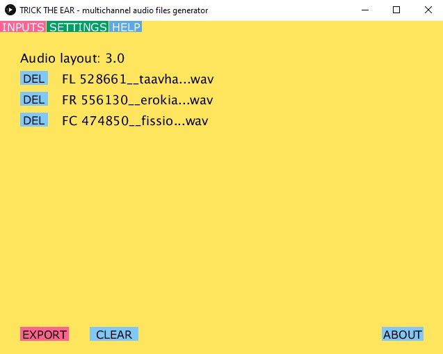

# Multi-channel audio encoder

Trick the Ear Multi-channel audio encoder is a tool for creating audio files that can be played in Trick the Ear spatial audio player. Please have a look at the live demo at [tricktheear.eu](https://tricktheear.eu/). Encoder will accept multiple individual audio files and merge them into one multi-channel audio file. Each input file is encoded as a separate audio channel.

## Download
* [MacOS](https://mega.nz/file/URgSzDDa#iV62VSkcKXTXX1OZ--E6CitO6VFUvgkgLsJXFOtLNmw)
* [Windows64bit](https://mega.nz/file/lJ4yUTAQ#U1-rcp02J-Gb2kYcddS7tO6iXsyjtehen2FCeBn0aEs)
* [Linux64bit](https://mega.nz/file/MNwSEJgI#v0rLUg8VBAzK79k938M3my7O1f_47bJezldYIHv1YEM)

Download links provide zipped archive with the tool. You don't need to install anything - just unzip it and run "create_multichannel_audio2.exe" file. In case the links are not working you can also download the encoder directly from Github (click green "Code" button on upper left and select download ZIP).

### Windows
Tested on Windows 10. It should work out of the box. Just double click the "create_multichannel_audio2.exe" file.

### MacOS
Tested on Catalina OS. On MacOs you need to allow installation from unknown sources. Open the Apple menu > System Preferences > Security & Privacy > General tab. Under Allow apps downloaded from select App Store and identified developers. To launch the app simply Ctrl-click on its icon > Open.

### Linux
Tested on Ubuntu 64bit. You can always run the app from the terminal. If using GUI and the app does not run when you double click the "create_multichannel_audio2" file icon you need to change the settings of your file explorer. In Nautilus file explorer click the hamburger menu (three lines icon next to minimise icon ), select "preferences". Click on "behaviour" tab, in the "Executable Text Files" option select "Run them". Close the dialogue and double click the "create_multichannel_audio2" file icon (bash script) - now it should start. The encoder is using [static builds](https://johnvansickle.com/ffmpeg/) of FFmpeg inside the "data" folder. You can swap that for your own ffmpeg build if needed.    

## What is this good for?
We have developed spatial audio web player that accepts one multichannel audio file. Each channel is separated during playback in the player and reperesnted in virtual sound space. This approach has the advantage of guaranteed synchronization between audio sources beacause they are loaded as a single file buffer. Another advanatage is easier maintainance as you can save single file instead of multiple ones. We propose this format as a standart for full featured spatial audio playback. File structure uses existing audio codecs such as Advanced audio codec and Ogg Vorbis and it is easily decodable. 

## How to use it?
After unzipping simply double click the executable to run the encoder. You will see a yellow window. Now you can drag and drop each audio stem / file that you want to merge onto the window. Their names will appear in the list. You can click "DEL" next to each other to remove it or click "CLEAR" to delete them all (they are only removed from the list, not physically deleted). Ensure that all the audio files you want to merge are of the same duration. When you have all the audio stems / files you want to merge into single song selected click "EXPORT". Now wait until the encoding is done and after you will find the exported file inside the "data" folder of the encoder. The folder with the exported file will automatically open. Now you can use this multi-channel file with the Trick the Ear spatial audio player.

Note that you can also adjust few settings. Click on the "SETTINGS" tab.  
* quality - adjust the bitrate. This is only used when the automatic quality is off. 
* automatic quality - whether to adjust bitrate automatically based on number of files. Turn this off if you are encoding single multi-channel file.
* multichannel input - default false. Change this to true if you already have multichannel .wav file and want to convert it to .aac for example.
* ogg export - whether to export the .ogg file should be exported as well. This is needed to ensure cross compatiblity with all web browsers. 
* aac export - whether to export the .aac file
				 
Currently up to 8 audio stems / files can be merged into single multi-channel audio file. 

## How does it work?
Under the hood the tool is programmed in Java for providing GUI and drag and drop functionality and for encoding it relies on [FFmpeg](https://ffmpeg.org/) library. This also means you can create these files even without the tool just using FFmpeg and command line.

For example if you would have three separate audio stems you want to merge into single multi-channel audio file you would use this command:

`"C:\path\ffmpeg.exe" -i "C:\Music\stem1.wav" -i "C:\Music\stem2.wav" -i "C:\Music\stem3.wav" -filter_complex "join=inputs=3:channel_layout=3.0:map=0.0-FL|1.0-FR|2.0-FC[out]" -map "[out]" -y -codec:a aac -b:a 192k -movflags +faststart`

This command will produce single Advance audio codec file from three wav files provided. Notice that you need to provide path to individual files, path to ffmpeg library and appropiate audio channel mapping. All of which is automatically done for you when using our tool. Our encoder will try to figure out right channel mapping based on number of files. Additionally it can also create Ogg Vorbis file to ensure cross compatibility with different web browsers.

## Licence
Please refer to the [licence](./licence_disclaimer.txt). You are allowed to use the software for non-commercial purposes as long as you keep original licence. Author is not liable for any damage caused by the software. Usage of the software is completely at your own risk. For commercial licencing please [https://tricktheear.eu/contact/](contact) us.   
